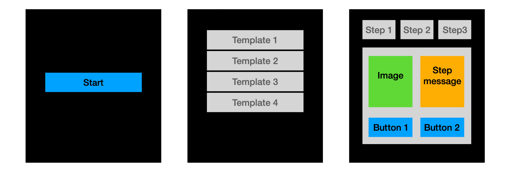

# Firmware Updater

Copyright (C) 2022, Jerry Belaston

## 💡 Overview

Firmware Updater is a C++ Qt application simulating a classical firmware update process based on JSON information coming from a mock server. 

This application has been implemented following [MVPMV architecture](https://docs.microsoft.com/en-us/archive/msdn-magazine/2011/december/mvpvm-design-pattern-the-model-view-presenter-viewmodel-design-pattern-for-wpf) approach. It demonstrates by the way the responsiveness of the Qt GUI regarding thread notifications.

Here a non-exhaustive list of the main implemented features:
- The mock server is a simple thread which watches the working directory every 2 sec for JSON templates file change.
- A template (from JSON templates file) is considered valid if it contains at least one step.
- Only when starting, the application saves a default JSON templates file in the working directory if no one exists.
- Welcome Screen 1 only show a Start button enabled only if at least one template is valid. Clicking on the button redirects to Screen 2.
- Template Browser Screen 2 allows to choose between the different templates retrieved from the mock server. Clicking on a template redirects to Screen 3.
- Stepper Screen 3 displays the update process and steps info containing in the template. The first previous button and the last next one redirects to Screen 2. Note that if the template contain only one step, the step bar is not displayed.

If any change occurs in the JSON templates file:
- we fallback to Screen 1, with the Start button disabled, if there is no valid template anymore.
- we fallback to Screen 2 if we were in Screen 3.

## 🔑 License

Licensed under the MIT license. Read the [LICENSE](LICENSE) file for details.

## ▶️ Precompiled binaries

Precompiled binaries can be found [here](https://github.com/jerry-belaston/firmwareUpdater/releases).

## ⚙️ Build and Installation

Follow the ["Quick user build and installation"](doc/installation.md) guide to bootstrap the firmwareUpdater environment.

## 🔍 Root folders definition

- `doc` as documentation, contains build and technical implementation info
- `ext` as external, contains external libraries/dependencies
- `res` as resources, contains application resources (images, samples, etc.)
- `src` as source, contains source code
